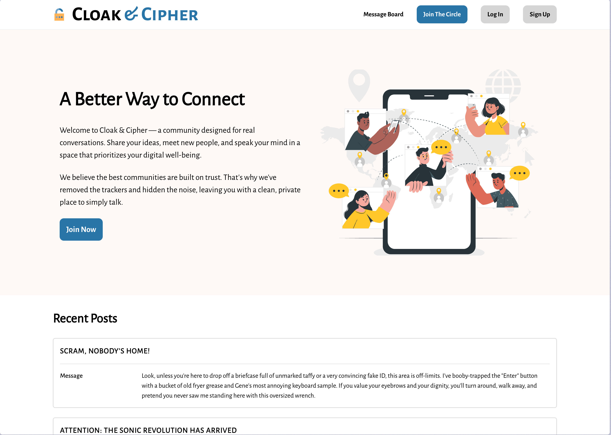
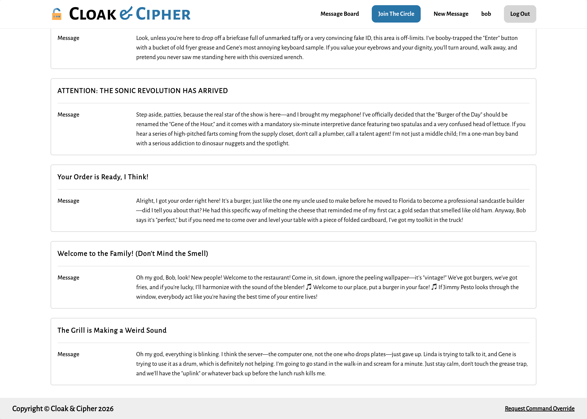
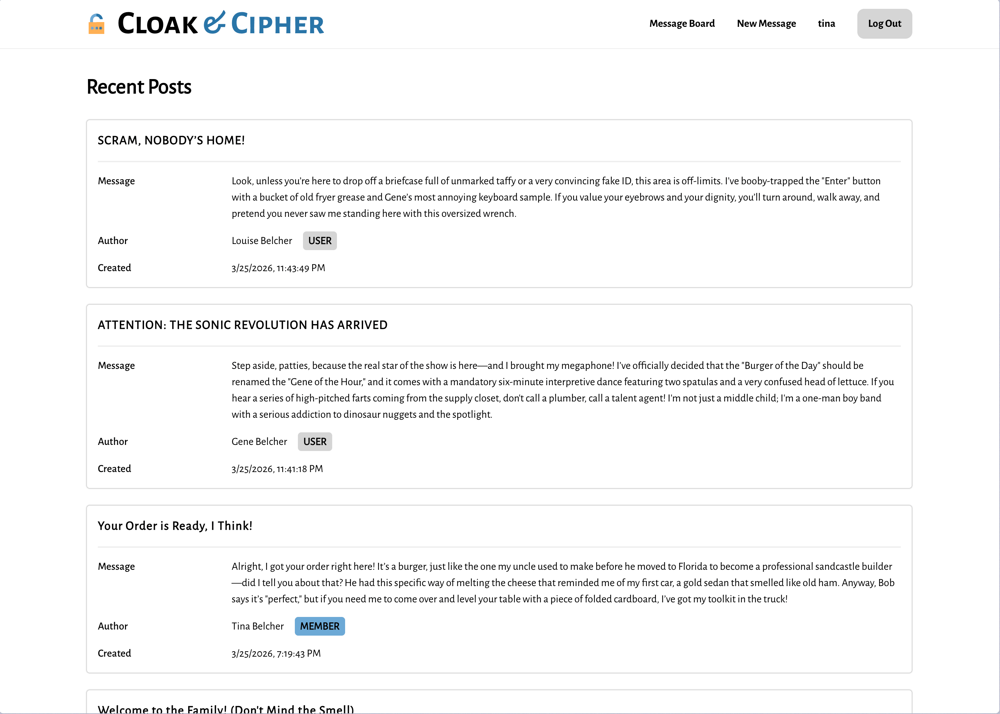
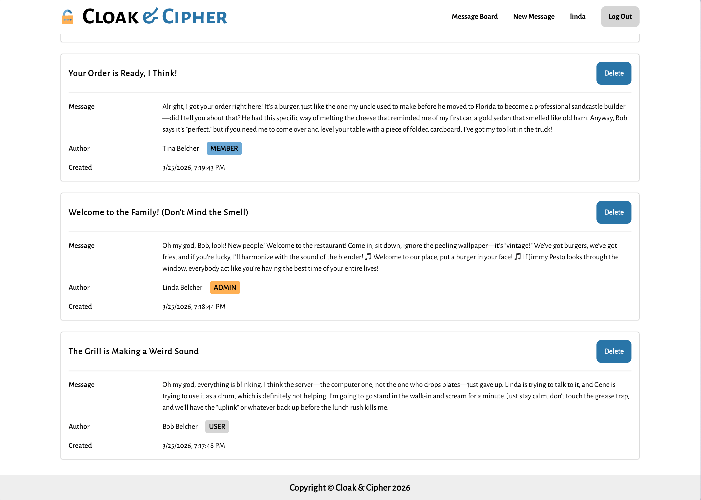

# The Odin Project: Members Only

This is a solution to the [Members Only Project](https://www.theodinproject.com/lessons/node-path-nodejs-members-only) as part of The Odin Project curriculum. 

## Table of contents

- [The Odin Project: Members Only](#the-odin-project-members-only)
  - [Table of contents](#table-of-contents)
  - [Overview](#overview)
    - [Features](#features)
    - [Screenshots](#screenshots)
    - [Links](#links)
  - [Credits](#credits)
    - [Icons \& Images](#icons--images)
    - [Fonts](#fonts)
    - [Useful resources](#useful-resources)

## Overview

Members Only is a forum like message board where you can connect with others, exchange ideas, and share your knowledge. It is a very simple app that allows you to create an account and post messages.

### Features

- Create an account and start posting messages.
- Your view is limited to message title and message body if you are a visitor or a registered user.
- You can view all message details (including author and date) if you are a member or an admin.
- You can delete any message if you are an admin.

### Screenshots

<table>
  <tr>
    <td align="center">
      
       
      <em>Visitor</em>
    </td>
    <td align="center">
      
       
      <em>User </em>
    </td>
  </tr>
  <tr>
    <td align="center">
      
       
      <em>Member</em>
    </td>
    <td align="center">
      
       
      <em>Admin</em>
    </td>
  </tr>
</table>

### Links

- [Solution URL](https://github.com/py-code314/members-only)
- [Live Site URL](https://members-only-hgar.onrender.com/)

## Credits

### Icons & Images

- All icons are from [SVG Repo](https://www.svgrepo.com/) 
- Illustration is from [Storyset](https://storyset.com/illustration/online-world/cuate)

### Fonts

- Alegreya Sans SC & Alegreya Sans fonts are downloaded from [Google Fonts](https://fonts.google.com/)
- All fonts are converted using [transfonter](https://transfonter.org/)

### Useful resources

- Naming strategy for CSS variables is from this Medium [article](https://medium.com/design-bootcamp/simple-design-tokens-with-css-custom-properties-7ab69b71d8ad)
- Box shadows generator - [getcssscan.com](https://getcssscan.com/css-box-shadow-examples)

**Notes:**
1. Use passphrase "**Elementary, my dear Watson!**" to become a member.
2. Use passcode "**01001100-O-L**" to become an admin.